# Xiaomi Philips Smart Ball Firmware

**NOTE: Firmware not finished yet, I will release it later.**

Recently I found the "Xiaomi Philips Smart LED Ball" and searched the Internet for some information. Unfortunately I didn't find much. That little bulb seems to be some joint venture between Xiaomi and Philips, but nowhere on the bulb is written Xiaomi, only Philips, same for the packaging.

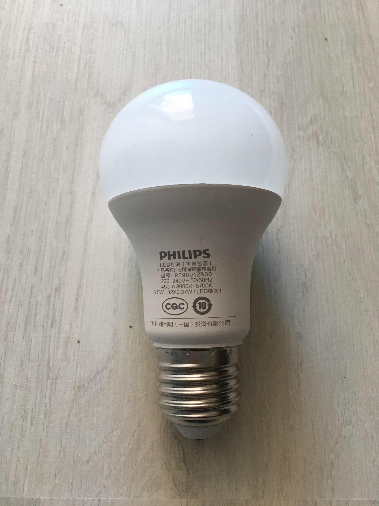

Since the bulb is WiFi enabled, I was wondering if the bulb was controlled by an ESP8266 or maybe an ESP32?

Spoiler alert: ESP8266.

What really interested me in that Bulb was the fact that it is cheap (around $10) and that this wasn't one of these fancy RGB CCT LED lights like the one from AiLight or the Sonoff B1. I don't need fancy colors in my home. What I want is a normal white LED bulb controlled via WiFi. And this bulb can do exactly that. The color temperature can be controlled from warm white to cold white and that's pretty neat.

Next thing was to open the bulb. I hoped that it could be easy like opening the Sonoff B1: Just pop off the cover. Well... it wasn't that easy.

So I started putting a sharp knife betwwen the cover and the main housing and started to spread it gently apart. I did that all around the bulb. Spread it, move the knife a little further, spread it again and so on.

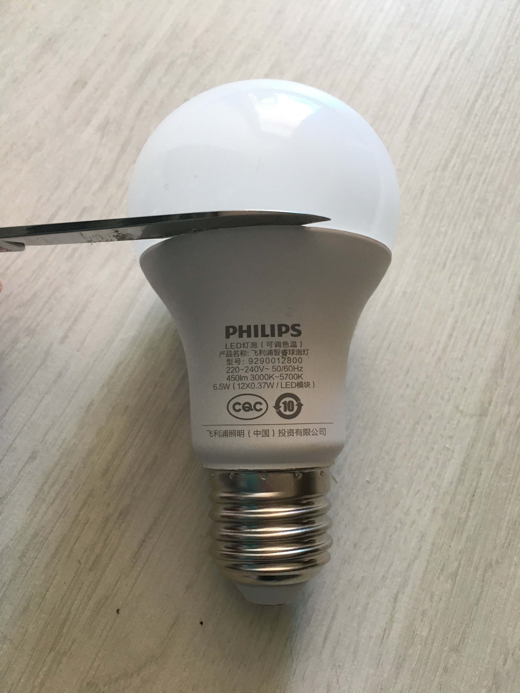

Do that gently to not damage the housing. After spreading it with the knife I already saw a little gap.

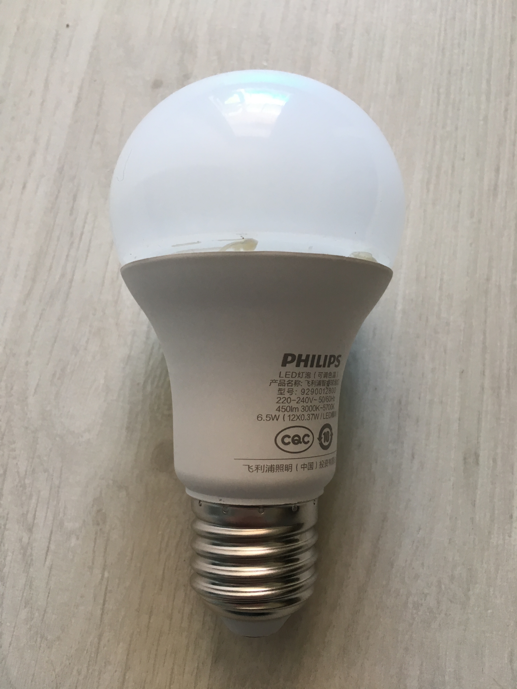

No it's time for some brute force. Take the main housing in on hand and the cover in the other hand and try to rip both parts apart. That needs for force and some tries. The parts are only heald together by silicone. I have already opened a few of these bulbs and with some practice it only takes 3 to 4 minutes until the bulb is open.

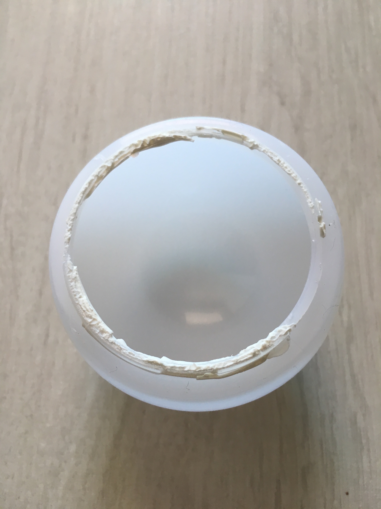

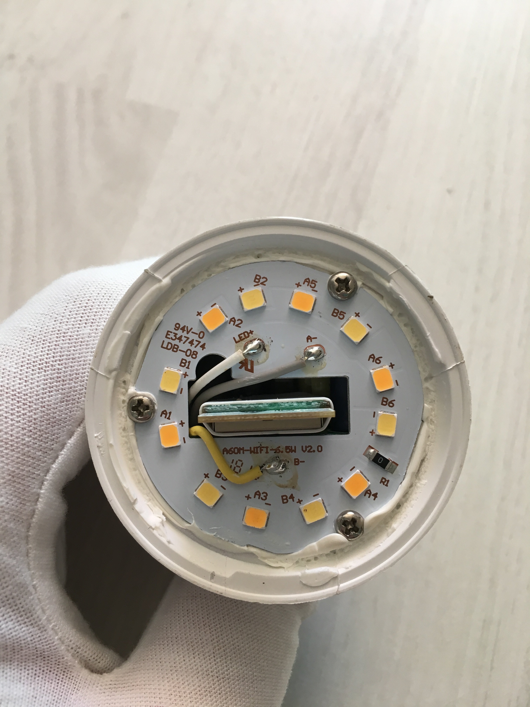

So what we see here is the ESP8266 in the middle and 6 cold white and 6 warm white LED's. The ESP8266 looks like an ordinary ESP12-E or ESP12-F board sitting on a carrier board. But I didn't open the bulb completely so I'm not really sure. I once removed the screws and then tried to remove the LED print but that seemed impossible without breaking the bulb.

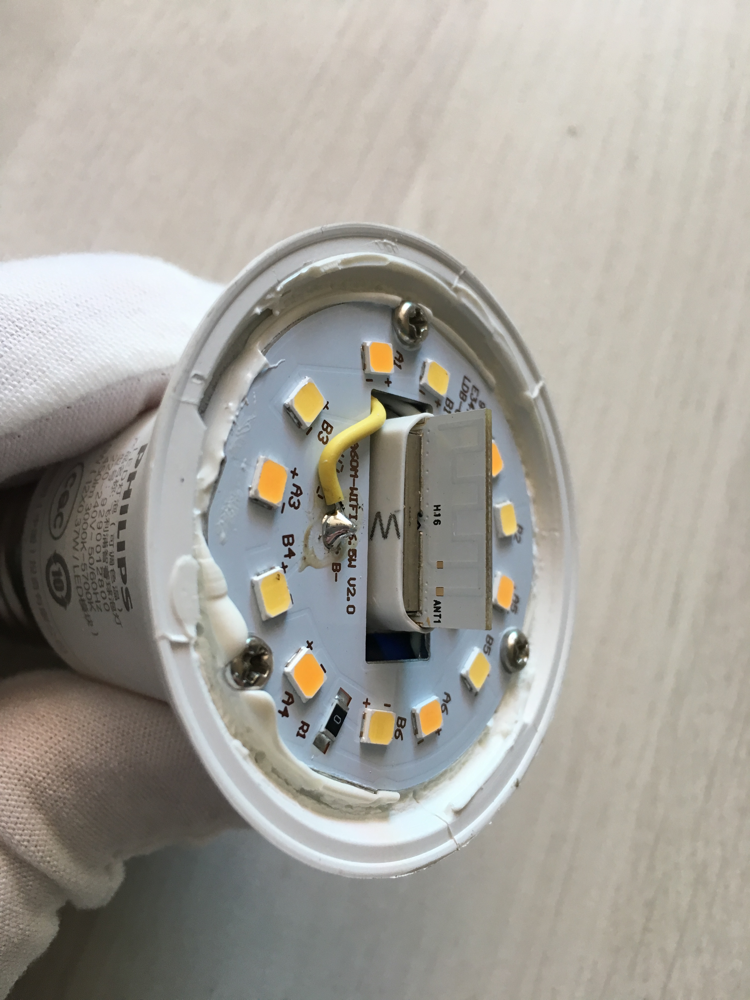

OK what's next? Well when I first opened the bulb I was euphoric to see that it could be an ESP8266. But hen the very next question was: Where the hell are the needed programming Pads/Pins?

No Pads on the LED print and as I said before, going deeper into the bulb is nearly impossible without destroying it. I couldn't believe that I came that far and now it's not possible to program that damn thing.

In my desperation I started removing the heat shrink tube around the ESP8266.

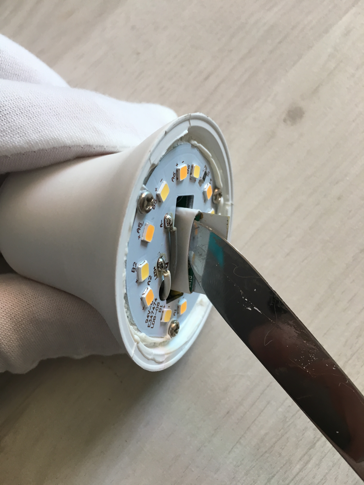

HEUREKA!!! I found those damn programming Ports!

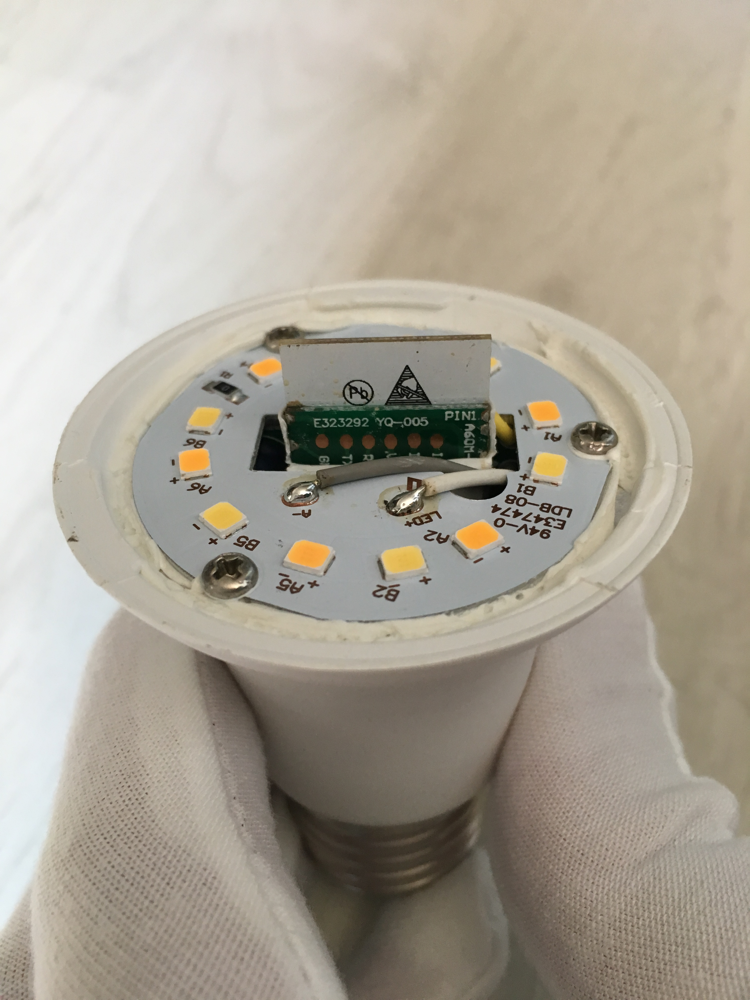

All needed pins are there: GND, TX, RX, VCC, GPIO15 and GPIO00 (in this order). Well GPIO15 is not needed for programming, no idea why they put it there, maybe for testing.

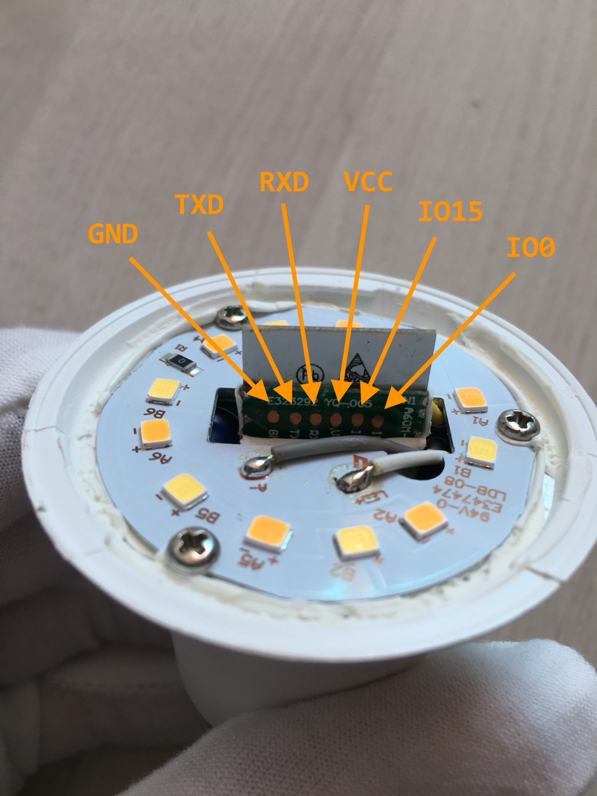

I then soldered some jumper cables to the pins and connected them to my USB2UART FTDI board. You can use any USB2UART adapter but make sure to select 3.3V signal logic. On many boards the voltage can be changed between 5V and 3.3V with a jumper.

Connection diagram:

| Bulb Pin | USB2UART Pin |
| :---: | :---: |
| GND | GND |
| TXD | RXD |
| RXD | TXD |
| VCC | VCC |
| GPIO0 | GND |

Oh and I hope that's clear but I'll mention it anyway:  
**DO NEVER EVER CONNECT THE USB2UART ADAPTER AND YOUR PC WHEN THE BULB IS CONNECTED TO MAINS VOLTAGE!!! DON'T EVEN OPEN THE BULB WHEN IT'S CONNECTED TO MAINS!!!**

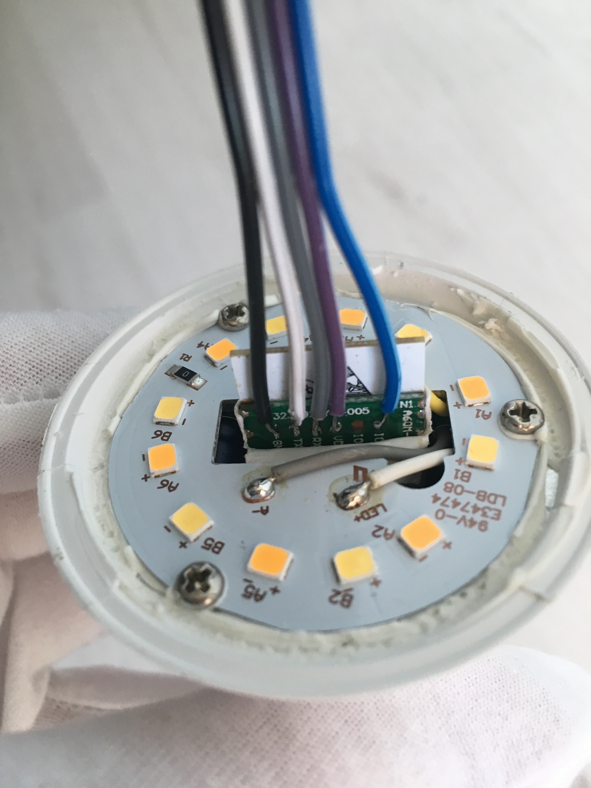

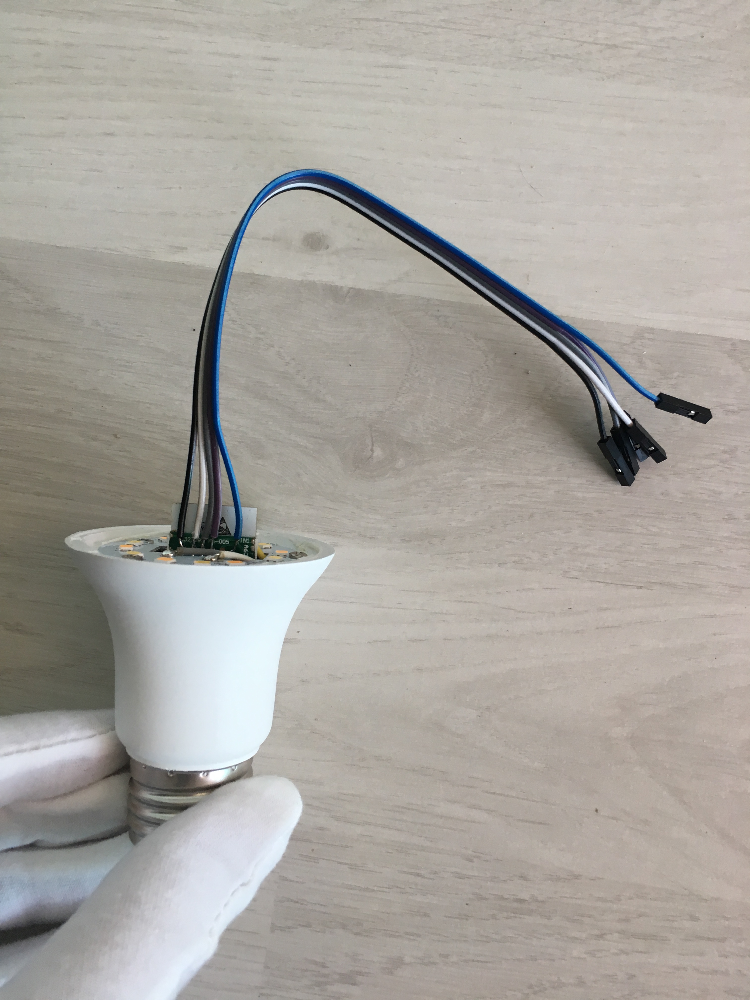

The rest is straight forward. Use [esptool.py](https://github.com/espressif/esptool) or one of your favorite IDEs like Arduino or PlatformIO to program the bulb with your own code. I will not cover that procedure here.

After programming you can remove the jumper cables and put the cover back on. The next time it's pretty easy to remove the cover. If you worked carefully when removing the cover you won't even notice that it was opened.

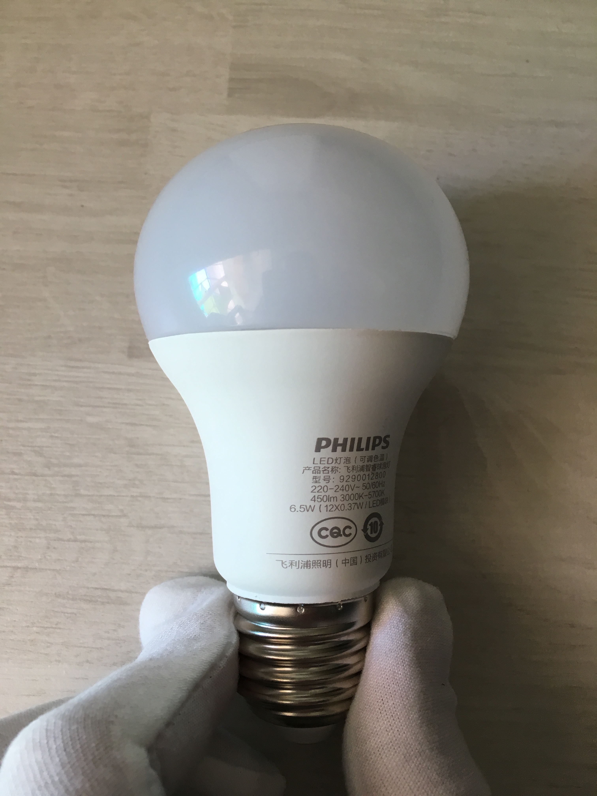

OK and what is needed to control the bulb? It's pretty easy: GPIO12 controls the color temperature without modifying the brightness. A value of 0 is warm white, a value of 1023 is cold white. GPIO15 controls the overall brightness of the bulb without changing the color temperature. Obviously 0 is off and 1023 is the max brightness.

Now have fun with your Xiaomi Philips Smart LED Ball. I hope that tutorial was helpful.
